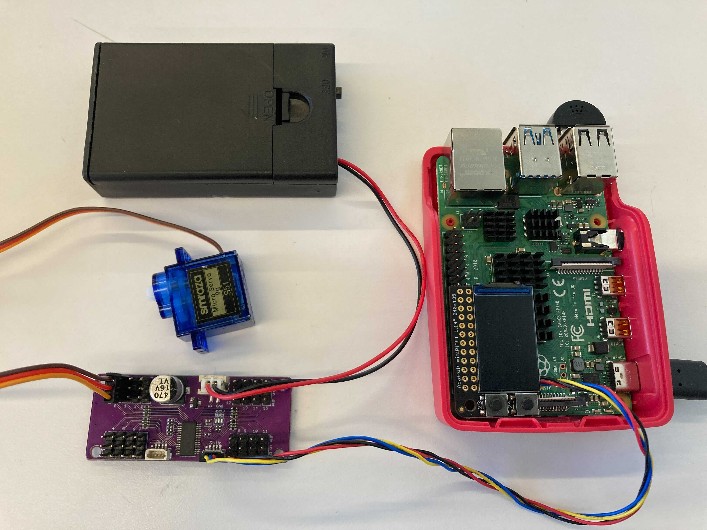

# Ph-UI!!!

For lab this week, we focus on both on sensing, to bring in new modes of input into your devices, as well as prototyping the physical look and feel of the device. You will think about the physical form the device needs to perform the sensing as well as present the display or feedback about what was sensed. 

## Part 1 Lab Preparation

### Get the latest content:
As always, pull updates from the class Interactive-Lab-Hub to both your Pi and your own GitHub repo. As we discussed in the class, there are 2 ways you can do so:

**\[recommended\]**Option 1: On the Pi, `cd` to your `Interactive-Lab-Hub`, pull the updates from upstream (class lab-hub) and push the updates back to your own GitHub repo. You will need the personal access token for this.

```
pi@ixe00:~$ cd Interactive-Lab-Hub
pi@ixe00:~/Interactive-Lab-Hub $ git pull upstream Fall2021
pi@ixe00:~/Interactive-Lab-Hub $ git add .
pi@ixe00:~/Interactive-Lab-Hub $ git commit -m "get lab4 content"
pi@ixe00:~/Interactive-Lab-Hub $ git push
```

Option 2: On your your own GitHub repo, [create pull request](https://github.com/FAR-Lab/Developing-and-Designing-Interactive-Devices/blob/2021Fall/readings/Submitting%20Labs.md) to get updates from the class Interactive-Lab-Hub. After you have latest updates online, go on your Pi, `cd` to your `Interactive-Lab-Hub` and use `git pull` to get updates from your own GitHub repo.

### Start brasinstorming ideas by reading: 
* [What do prototypes prototype?](https://www.semanticscholar.org/paper/What-do-Prototypes-Prototype-Houde-Hill/30bc6125fab9d9b2d5854223aeea7900a218f149)
* [Paper prototyping](https://www.uxpin.com/studio/blog/paper-prototyping-the-practical-beginners-guide/) is used by UX designers to quickly develop interface ideas and run them by people before any programming occurs. 
* [Cardboard prototypes](https://www.youtube.com/watch?v=k_9Q-KDSb9o) help interactive product designers to work through additional issues, like how big something should be, how it could be carried, where it would sit. 
* [Tips to Cut, Fold, Mold and Papier-Mache Cardboard](https://makezine.com/2016/04/21/working-with-cardboard-tips-cut-fold-mold-papier-mache/) from Make Magazine.
* [Surprisingly complicated forms](https://www.pinterest.com/pin/50032245843343100/) can be built with paper, cardstock or cardboard.  The most advanced and challenging prototypes to prototype with paper are [cardboard mechanisms](https://www.pinterest.com/helgangchin/paper-mechanisms/) which move and change. 
* [Dyson Vacuum Cardboard Prototypes](http://media.dyson.com/downloads/JDF/JDF_Prim_poster05.pdf)
<p align="center"> </p>

### Gathering materials for this lab:

* Cardboard (start collecting those shipping boxes!)
* Found objects and materials--like bananas and twigs.
* Cutting board
* Cutting tools
* Markers

(We do offer shared cutting board, cutting tools, and markers on the class cart during the lab, so do not worry if you don't have them!)

## Deliverables \& Submission for Lab 4

The deliverables for this lab are, writings, sketches, photos, and videos that show what your prototype:
* "Looks like": shows how the device should look, feel, sit, weigh, etc.
* "Works like": shows what the device can do.
* "Acts like": shows how a person would interact with the device.

For submission, the readme.md page for this lab should be edited to include the work you have done:
* Upload any materials that explain what you did, into your lab 4 repository, and link them in your lab 4 readme.md.
* Link your Lab 4 readme.md in your main Interactive-Lab-Hub readme.md. 
* Group members can turn in one repository, but make sure your Hub readme.md links to the shared repository.
* Labs are due on Mondays, make sure to submit your Lab 4 readme.md to Canvas.


## Lab Overview

A) [Capacitive Sensing](#part-a)

B) [OLED screen](#part-b) 

C) [Paper Display](#part-c)

D) [Materiality](#part-d)

E) [Servo Control](#part-e)

F) [Record the interaction](#part-f)

## The Report (Part 1: A-D, Part 2: E-F)

### Part A
### Capacitive Sensing, a.k.a. Human-Twizzler Interaction 

We want to introduce you to the [capacitive sensor](https://learn.adafruit.com/adafruit-mpr121-gator) in your kit. It's one of the most flexible input devices we are able to provide. At boot, it measures the capacitance on each of the 12 contacts. Whenever that capacitance changes, it considers it a user touch. You can attach any conductive material. In your kit, you have copper tape that will work well, but don't limit yourself! In the example below, we use Twizzlers--you should pick your own objects.


<p float="left">


</p>

Plug in the capacitive sensor board with the QWIIC connector. Connect your Twizzlers with either the copper tape or the alligator clips (the clips work better). In this lab, we will continue to use the `circuitpython` virtual environment we created before. Activate `circuitpython` and `cd` to your Lab 4 folder to install the requirements by:

```
(circuitpython) pi@ixe00:~/Interactive-Lab-Hub/Lab 4 $ pip3 install -r requirements.txt
```


These Twizzlers are connected to pads 6 and 10. When you run the code and touch a Twizzler, the terminal will print out the following

```
(circuitpython) pi@ixe00:~/Interactive-Lab-Hub/Lab 4 $ python cap_test.py 
Twizzler 10 touched!
Twizzler 6 touched!
```

### Part B
### More sensors

#### Light/Proximity/Gesture sensor (APDS-9960)

We here want you to get to know this awesome sensor [Adafruit APDS-9960](https://www.adafruit.com/product/3595). It is capable of sensing proximity, light (also RGB), and gesture! 


Connect it to your pi with Qwiic connector and try running the three example scripts individually to see what the sensor is capable of doing!

```
(circuitpython) pi@ixe00:~/Interactive-Lab-Hub/Lab 4 $ python proximity_test.py
...
(circuitpython) pi@ixe00:~/Interactive-Lab-Hub/Lab 4 $ python gesture_test.py
...
(circuitpython) pi@ixe00:~/Interactive-Lab-Hub/Lab 4 $ python color_test.py
...
```

You can go the the [Adafruit GitHub Page](https://github.com/adafruit/Adafruit_CircuitPython_APDS9960) to see more examples for this sensor!

#### Rotary Encoder

A rotary encoder is an electro-mechanical device that converts the angular position to analog or digital output signals. The [Adafruit rotary encoder](https://www.adafruit.com/product/4991#technical-details) we ordered for you came with separated breakout board and encoder itself, that is, they will need to be soldered if you have not yet done so! We will be bringing the soldering station to the lab class for you to use, also, you can go to the MakerLAB to do the soldering off-class. Here is some [guidance on soldering](https://learn.adafruit.com/adafruit-guide-excellent-soldering/preparation) from Adafruit. When you first solder, get someone who has done it before (ideally in the MakerLAB environment). It is a good idea to review this material beforehand so you know what to look at.

<p float="left">


</p>

Connect it to your pi with Qwiic connector and try running the example script, it comes with an additional button which might be useful for your design!

```
(circuitpython) pi@ixe00:~/Interactive-Lab-Hub/Lab 4 $ python encoder_test.py
```

You can go to the [Adafruit Learn Page](https://learn.adafruit.com/adafruit-i2c-qt-rotary-encoder/python-circuitpython) to learn more about the sensor! The sensor actually comes with an LED (neo pixel): Can you try lighting it up? 

#### Joystick

A [joystick](https://www.sparkfun.com/products/15168) can be used to sense and report the input of the stick for it pivoting angle or direction. It also comes with a button input!

<p float="left">

</p>

Connect it to your pi with Qwiic connector and try running the example script to see what it can do!

```
(circuitpython) pi@ixe00:~/Interactive-Lab-Hub/Lab 4 $ python joystick_test.py
```

You can go to the [SparkFun GitHub Page](https://github.com/sparkfun/Qwiic_Joystick_Py) to learn more about the sensor!

#### (Optional) Distance Sensor

Note: We did not distribute this sensor to you, so if you are interested in playing with it, please come pick it up from the TA!

Earlier we have asked you to play with the proximity sensor, which is able to sense object within a short distance. Here, we offer [Qwiic Multi Distance Sensor](https://www.sparkfun.com/products/17072), which has a field of view of about 25° and is able to detect objects up to 3 meters away! 

<p float="left">

</p>

Connect it to your pi with Qwiic connector and try running the example script to see how it works!

```
(circuitpython) pi@ixe00:~/Interactive-Lab-Hub/Lab 4 $ python distance_test.py
```

You can go to the [SparkFun GitHub Page](https://github.com/sparkfun/Qwiic_VL53L1X_Py) to learn more about the sensor and see other examples!

### Part C
### Physical considerations for sensing

Usually, sensors need to positioned in specific locations or orientations to make them useful for their application. Now that you've tried a bunch of the sensors, pick one that you would like to use, and an application where you use the output of that sensor for an interaction. For example, you can use a distance sensor to measure someone's height if you position it overhead and get them to stand under it.

**\*\*\*Draw 5 sketches of different ways you might use your sensor, and how the larger device needs to be shaped in order to make the sensor useful.\*\*\***


**\*\*\*What are some things these sketches raise as questions? What do you need to physically prototype to understand how to anwer those questions?\*\*\***

The sketches raise usability as questions - for example, it is unclear how the stove protector would actually be effective in determining if someone is near the stove. Physically prototyping what the device will look like and placing it in the approximate position where the actual device will reside will allow me to determine if the device is designed well.

**\*\*\*Pick one of these designs to prototype.\*\*\***

I will prototype the Automatic Light Switch, which uses the proximity sensor to determine whether or not a light should be switched on or off.

### Part D
### Physical considerations for displaying information and housing parts


Here is an Pi with a paper faceplate on it to turn it into a display interface:


This is fine, but the mounting of the display constrains the display location and orientation a lot. Also, it really only works for applications where people can come and stand over the Pi, or where you can mount the Pi to the wall.

Here is another prototype for a paper display:


Your kit includes these [SparkFun Qwiic OLED screens](https://www.sparkfun.com/products/17153). These use less power than the MiniTFTs you have mounted on the GPIO pins of the Pi, but, more importantly, they can be more flexibily be mounted elsewhere on your physical interface. The way you program this display is almost identical to the way you program a  Pi display. Take a look at `oled_test.py` and some more of the [Adafruit examples](https://github.com/adafruit/Adafruit_CircuitPython_SSD1306/tree/master/examples).

<p float="left">


</p>


It holds a Pi and usb power supply, and provides a front stage on which to put writing, graphics, LEDs, buttons or displays.

This design can be made by scoring a long strip of corrugated cardboard of width X, with the following measurements:

| Y height of box <br> <sub><sup>- thickness of cardboard</sup></sub> | Z  depth of box <br><sub><sup>- thickness of cardboard</sup></sub> | Y height of box  | Z  depth of box | H height of faceplate <br><sub><sup>* * * * * (don't make this too short) * * * * *</sup></sub>|
| --- | --- | --- | --- | --- | 

Fold the first flap of the strip so that it sits flush against the back of the face plate, and tape, velcro or hot glue it in place. This will make a H x X interface, with a box of Z x X footprint (which you can adapt to the things you want to put in the box) and a height Y in the back. 

Here is an example:


Think about how you want to present the information about what your sensor is sensing! Design a paper display for your project that communicates the state of the Pi and a sensor. Ideally you should design it so that you can slide the Pi out to work on the circuit or programming, and then slide it back in and reattach a few wires to be back in operation.
 
**\*\*\*Sketch 5 designs for how you would physically position your display and any buttons or knobs needed to interact with it.\*\*\***


**\*\*\*What are some things these sketches raise as questions? What do you need to physically prototype to understand how to anwer those questions?\*\*\***

These sketches only show the outside of the device - it is unclear how the sensors/buttons will be mounted to the inside of the housing. I would need to physically prototype the device and place buttons and sensors in order to understand how all of this will work.

**\*\*\*Pick one of these display designs to integrate into your prototype.\*\*\***

I will integrate display 4, which uses the ambient lighting to control the light, along with a display that shows relevant information and a button to toggle the state of the light.

**\*\*\*Explain the rationale for the design.\*\*\*** (e.g. Does it need to be a certain size or form or need to be able to be seen from a certain distance?)

The design is made so because there are cases where the ambient lighting is not the only factor that determines if a light should be turned on. For example, if it is time to go to bed, one may choose to turn the light off, even if it is dark outside. However, the device may still be useful in situations where it may be inconvenient to get up and turn the light on.

Build a cardbord prototype of your design.

**\*\*\*Document your rough prototype.\*\*\***

This prototype implements design 4 - one challenge I faced in terms of building this prototype was making sure the holes in the box were long enough for I2C cables to connect everywhere they needed to connect. A bit of reworking is necessary and will be done in order to ensure that the button can be connected to the top of the device (next to the sensor).

#### Front Side


#### Top


LAB PART 2

### Part 2

Following exploration and reflection from Part 1, complete the "looks like," "works like" and "acts like" prototypes for your design, reiterated below.

### Part E (Optional)
### Servo Control with Joystick

In the class kit, you should be able to find the [Qwiic Servo Controller](https://www.sparkfun.com/products/16773) and [Micro Servo Motor SG51](https://www.adafruit.com/product/2201). The Qwiic Servo Controller will need external power supply to drive, which we will be distributing the battery packs in the class. Connect the servo controller to the miniPiTFT through qwiic connector and connect the external battery to the 2-Pin JST port (ower port) on the servo controller. Connect your servo to channel 2 on the controller, make sure the brown is connected to GND and orange is connected to PWM.



In this exercise, we will be using the nice [ServoKit library](https://learn.adafruit.com/16-channel-pwm-servo-driver/python-circuitpython) developed by Adafruit! We will continue to use the `circuitpython` virtual environment we created. Activate the virtual environment and make sure to install the latest required libraries by running:

```
(circuitpython) pi@ixe00:~/Interactive-Lab-Hub/Lab 4 $ pip3 install -r requirements.txt
```

A servo motor is a rotary actuator or linear actuator that allows for precise control of angular or linear position. The position of a servo motor is set by the width of an electrical pulse, that is, we can use PWM (pulse-width modulation) to set and control the servo motor position. You can read [this](https://learn.adafruit.com/adafruit-arduino-lesson-14-servo-motors/servo-motors) to learn a bit more about how exactly a servo motor works.

Now that you have a basic idea of what a servo motor is, look into the script `qwiic_servo_example.py` we provide. In line 14, you should see that we have set up the min_pulse and max_pulse corresponding to the servo turning 0 - 180 degree. Try running the servo example code now and see what happens:

```
(circuitpython) pi@ixe00:~/Interactive-Lab-Hub/Lab 4 $ python servo_test.py
```

It is also possible to control the servo using the sensors mentioned in as in part A and part B, and/or from some of the buttons or parts included in your kit, the simplest way might be to chain Qwiic buttons to the other end of the Qwiic OLED. Like this:

<p align="center"> </p>

You can then call whichever control you like rather than setting a fixed value for the servo. For more information on controlling Qwiic devices, Sparkfun has several python examples, such as [this](https://learn.sparkfun.com/tutorials/qwiic-joystick-hookup-guide/all#python-examples).

We encourage you to try using these controls, **while** paying particular attention to how the interaction changes depending on the position of the controls. For example, if you have your servo rotating a screen (or a piece of cardboard) from one position to another, what changes about the interaction if the control is on the same side of the screen, or the opposite side of the screen? Trying and retrying different configurations generally helps reveal what a design choice changes about the interaction -- _make sure to document what you tried_!

### Part F
### Record

Given the lack of success with the design in Part 1 of the lab, I decided to change the interaction and design of the device. Instead of automatically turning on a light, I created a device that would give recommendations to people on whether or not it is an appropriate time to turn on the light. The interaction is storyboarded here:


Given the storyboard, I designed the device as follows. The top of the device housed the light sensor, and the front of the device housed the button (made of conductive tape).  In the rear of the device lives the speaker that uses TTS to speak out the recommendations. We can see pictures of the design drawings here:


We can see pictures of the implemented device here:


Lastly, [here](https://drive.google.com/file/d/1TGw58sp0vscNIIKfUL4BpWCmBx-HsiNe/view?usp=sharing) is a link to the recording of the interaction.

Document all the prototypes and iterations you have designed and worked on! Again, deliverables for this lab are writings, sketches, photos, and videos that show what your prototype:
* "Looks like": shows how the device should look, feel, sit, weigh, etc.
* "Works like": shows what the device can do
* "Acts like": shows how a person would interact with the device

